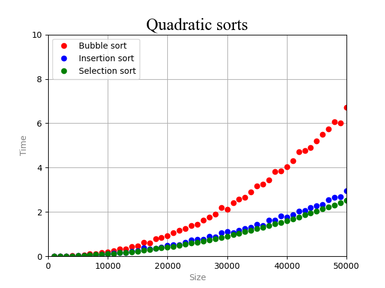

# Пункт 1

Сортировка пузырьком работает медленне сортировок всавками и выбором из-за большего числа свапов.

# Пункт 2

Быстрые сортировки с разным выбором опорных работают примерно одинаково, т.к. сортируется случайный массив.

# Пункт 3

Быстрая сортировка работает быстрее сортировки слиянием, т.к. сортировка слиянием много раз использует функцию выделения памяти.

# Вывод

Нет ничего удивительного в том, что быстрая сортировка и сортировка слиянием работают гораздо быстрее, чем квадратичные сортировки
